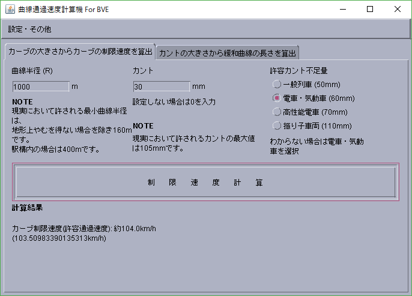
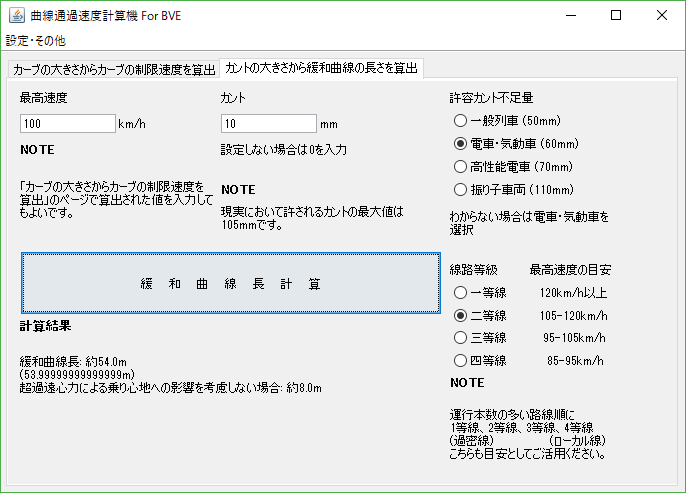

# BVEツール

ここでは、BVEデータの作成を補助するためのソフトウェアを公開しています。

## 曲線通過速度計算機 For BVE

​

カーブの大きさからカーブの制限速度を算出したり、カントと最高速度から緩和曲線の長さを算出したりできます。​

逆の使い方として、あらかじめ頭の中で理想の速度を決めてから、それに近い速度を実現できるカーブ、カントの大きさを算出させるということも可能です。

---

特に架空路線などで、

*「この大きさのカーブではどれくらいの速度が出せるだろうか」「緩和曲線はどれくらいが最適だろうか」*

ということを考える必要がなくなります。

​(狭軌(1067mm)で最適な解が算出されるように設計しております。標準軌(1435mm)へは最適化しておりません。)

<ul class="downloads">
<a href="{{ site.downloadurl_curve }}" target="_blank" rel="noopener noreferrer"> <strong>ダウンロード</strong> GitHub</a>
</ul>

動作にはJavaが必要です。起動しても「Javaがない」という旨の英文エラーが表示される場合、下記URLから

Java Runtime environment をダウンロード・インストールしてください。

[https://java.com/ja/download/](https://java.com/ja/download/){:target="_blank"}