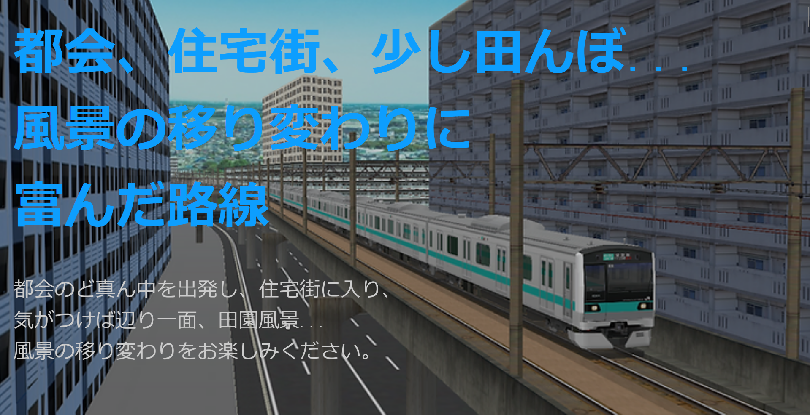
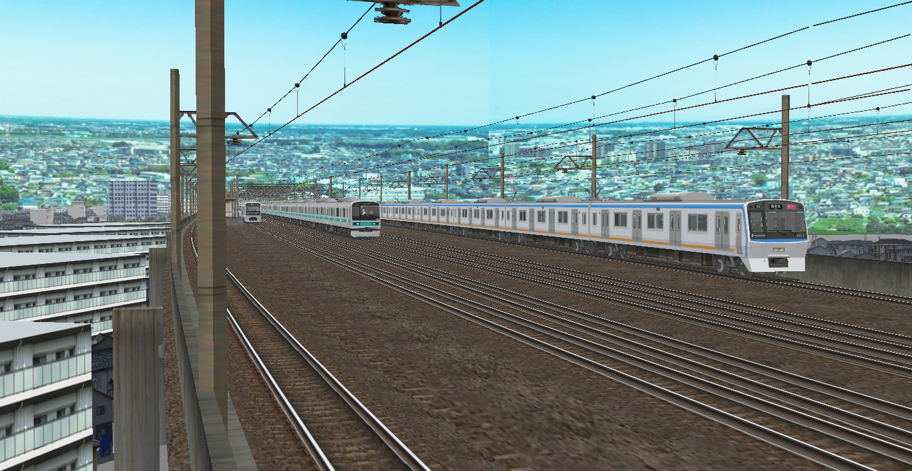
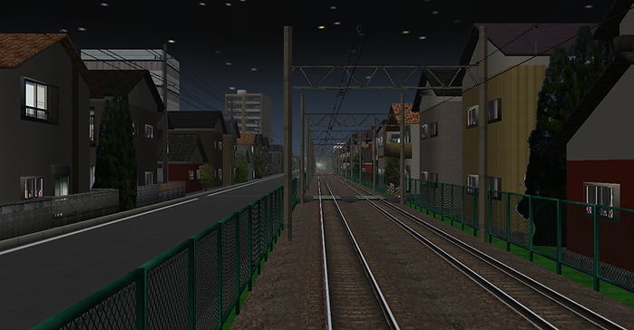
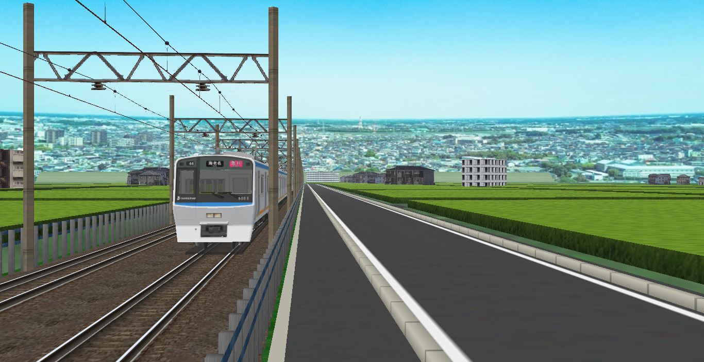
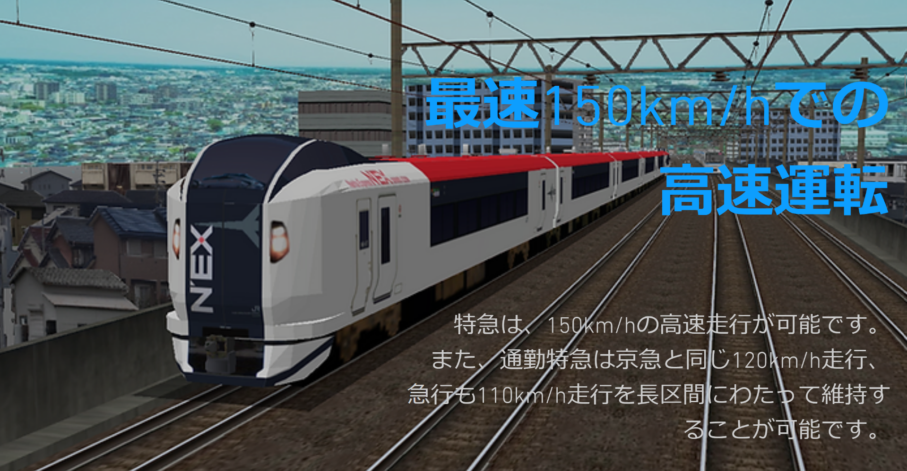
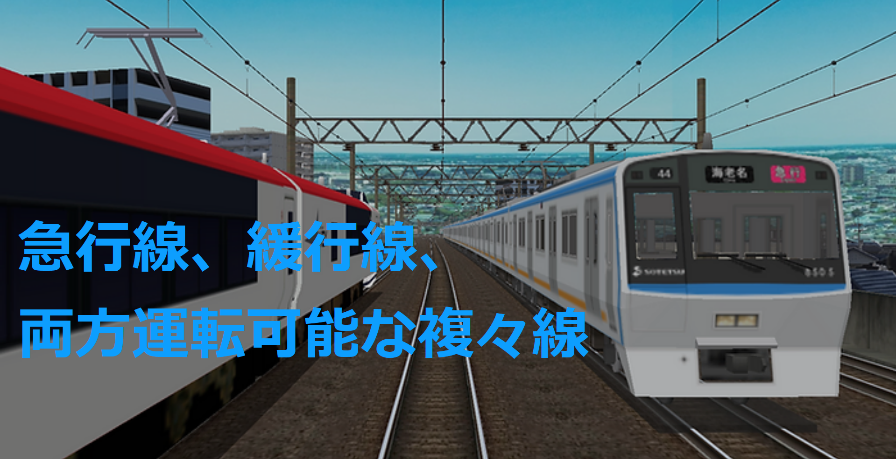
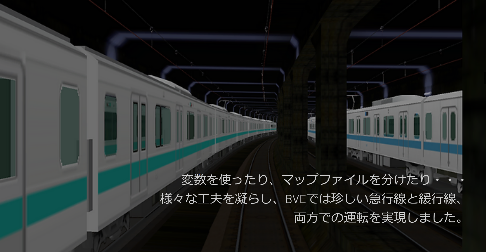
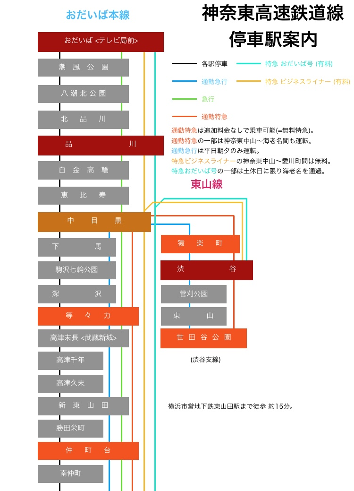
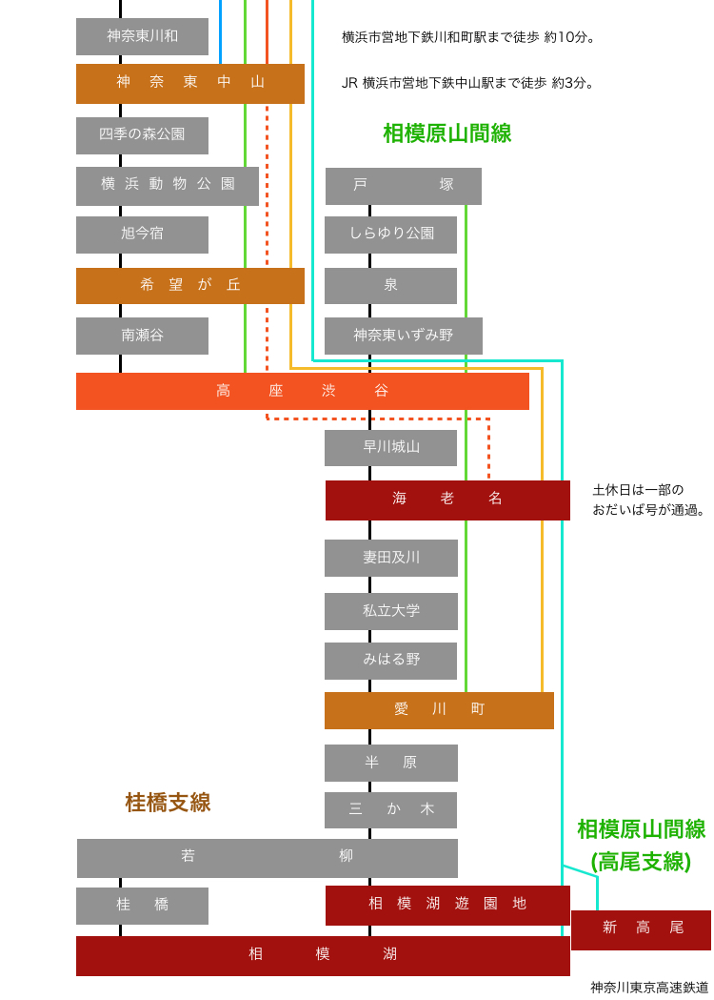

# 神奈東高速鉄道

​

## 目次

- [ダウンロード](#ダウンロード)
  - [動作環境](#動作環境)
  - [指定車両](#指定車両)
  - [運転指南(運転方法)](#運転指南)
- [路線特徴](#路線特徴)
- [停車駅案内・路線地図](#停車駅案内・路線地図)

---

# ダウンロード

ver.2.0.6  **神奈東高速鉄道 神奈東おだいば本線  (全線) ・ 神奈東相模原山間線  (全線)**

最終更新: 2019/11/25

<ul class="downloads">
<a href="{{ site.downloadurl_kanato }}" target="_blank" rel="noopener noreferrer"> <strong>ダウンロード</strong> Google Drive</a>
</ul>

**​必ず、当サイト内の[「データ利用規約」](rule)をご覧ください。二次配布はご遠慮ください。**

---

### 動作環境

* **BVE 5.6推奨** (5.7だと一部のストラクチャが正常に描画されません。)

* **要 樽ﾓﾄ氏作[「nagoya_common」](https://moffbarrel.stars.ne.jp/)**{:target="_blank"}

※運転の際は、ほかのアプリケーションの終了、BVEの再起動をお勧めします。
​

### 前回、前々回からの変更点

* 他列車の走行音を大きく
* 特急の制限速度引き上げ(みはる野～愛川町間 100km/h → 130-150km/h  三か木～若柳間 100km/h → 130km/h)
* おだいば本線の「まもなく高座渋谷」アナウンスで、終点の放送がされていなかったのを修正
* 相模湖駅の架線が終了されていなかったことと、特急シナリオの単線区間の架線が二重になっていたのを修正
* その他細かい沿線風景のブラッシュアップ・メモリをなるべく占有しないよう修正
 

###  指定車両

以下のデータをDLしてください。車両の指定作業は不要です。

|  シナリオ  |  列車名  |  ダウンロード先  |  備考  |
| ---- | ---- | ---- | ---- |
|  おだいば本線 各駅停車  |  東武9050系  |  [vertah's warehouse](http://vertah.sakura.ne.jp/){:target="_blank"} (HTTPで接続してください。)  |    |
|  おだいば本線 通勤急行  |  西武6000系  |  [循環車線](https://sigf.sakura.ne.jp/){:target="_blank"}  |    |
|  おだいば本線 急行  |  東急9000系  |  [循環車線](https://sigf.sakura.ne.jp/){:target="_blank"}  |    |
|  おだいば本線 通勤特急  |  ＪＲE531系  |  [Tc's Development room](https://tce230-20.wixsite.com/tcdevroom){:target="_blank"}  |  **以下のデータも必要** ＪＲ線車両パック [Rock_On氏(みかんごーごー氏)のGitHubリポジトリ](https://github.com/mikangogo/JRTrainPack/releases){:target="_blank"} ＪＲE501系 [Kazuma's BVE Website](https://kazmasbve.soregashi.com/){:target="_blank"}  |
|  相模原山間線  |  ＪＲ 205系5000番台総武車    (武蔵野線)  |  柏鉄道フォーラム  |  **閉鎖してしまったので、別の列車を指定してください**  |
|  特急  |  ＪＲE257系500番台  |  柏鉄道フォーラム  |  **閉鎖してしまったので、別の列車を指定してください**  |

- 各駅停車・・・東武9050系    vertah氏のサイト・・・・・[vertah's warehouse](http://vertah.sakura.ne.jp/){:target="_blank"} (HTTPS接続では接続できません。HTTPで接続してください。)

- 通勤急行・・・西武6000系    shallow-filed氏のサイト・・[循環車線](https://sigf.sakura.ne.jp/){:target="_blank"}

-   急    行  ・・・東急9000系    shallow-filed氏のサイト・・[循環車線](https://sigf.sakura.ne.jp/){:target="_blank"}

- 通勤特急・・・ＪＲE531系    Tc E230-20氏のサイト・・・[Tc's Development room](https://tce230-20.wixsite.com/tcdevroom){:target="_blank"}

  - E531系の運転にあたって以下のデータが必要です。同様にダウンロードしてください。

  - ＪＲ線車両パック Rock_On氏(みかんごーごー氏)のサイト(GitHubリポジトリ)→ [https://github.com/mikangogo/JRTrainPack/releases](https://github.com/mikangogo/JRTrainPack/releases){:target="_blank"}

  - ＪＲE501系     Kazuma氏のサイト→ [Kazuma's BVE Website](https://kazmasbve.soregashi.com/){:target="_blank"}

- 相模原山間線 ・・・ＪＲ 205系5000番台総武車    (武蔵野線)    舞姫氏のサイト・・・ **閉鎖してしまったので、別の列車を**

- 特       急     ・・・ＪＲE257系500番台                 (房総特急)    舞姫氏のサイト・・・ **指定してください。**

​
### 運転指南

​[運転指南ページ](driveguide)へ。

## 路線特徴

詳しい路線概要は[設定資料のページ](settings)にございます。

 

**おだいば本線 (全線運転可)**

おだいば駅と高座渋谷駅を結ぶ約50.4kmの路線です。神奈川北東部から都心へ直結する重要な路線です(多分)。

複々線区間は中目黒から神奈東中山までの約25.6kmで、私鉄最長複々線区間を持つ東武鉄道伊勢崎線(スカイツリーライン)の複々線区間合計(20.2km)より長くなっています。

**東山線**
中目黒駅と世田谷公園駅を渋谷経由で結ぶ約3.4kmの路線です。おだいば本線の支線扱いです。渋谷前後での急カーブが特徴です。

**相模原山間線 (全線運転可)**
戸塚駅と相模湖駅を結ぶ約46.6kmの路線です。通勤特急、特急は高座渋谷駅でおだいば本線と直通します。

神奈川西部の通勤輸送と観光輸送が主な目的です。

**相模原山間線高尾支線**

若柳駅と高尾山のふもと、新高尾駅を結ぶ路線です。相模原山間線の支線扱いで、同線の一部として扱われます。

特急のみ走ります。

**桂橋支線**

若柳駅と相模湖駅を桂橋駅経由で結ぶ路線です。相模原山間線の支線扱いです。

神奈東線唯一の非電化区間です。よって、この路線に乗り入れる車両もその逆もなく、独立しています。

## 停車駅案内・路線地図

​

(路線地図 UNDER CONSTRUCTION)